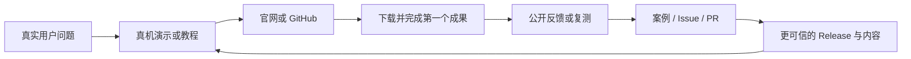

# AgentPlay 长期推广与开源增长总方案

> 版本：2026-09-06 · 唯一推广总方案，继承2026-08-29已确认路线 
> 阶段：产品功能冻结，进入“发布一致性收口 + 真实用户增长 + 开源社区复利” 
> 原则：不买 Star、不互刷、不群发、不编造案例、不把维护者或 CI 数据冒充用户。

## 1. 结论先行

### 2026-09-06 当前交付状态

[Preview4已公开](https://github.com/wg5759/AgentPlay/releases/tag/v0.9.1-preview.4)，PR44/45已合并，桌面同步和9项匿名完整下载哈希验证完成；条件与已知限制见[发布回执](RELEASE_0.9.1_PREVIEW4.md)。三模型会审不再是门槛。首次组件准备和快速外部打开仍有超时观察，先处理可复现反馈，再扩大推广，不把本次Preview称为无缺陷Stable。

本页恢复本机已确认的12个月完整方案，不是新增规划。[先前公开短版](https://github.com/wg5759/AgentPlay/blob/ded8d64543c437e3a1f69240f2f65670cf43f361/docs/GITHUB_GROWTH_PLAN.md)保留在Git历史；下方2026-08-29/09-02/09-05的快照保留历史口径，不作为今日未完成结论。内部审查草稿与私人维护记录保留在本机，不随本页分发。

### 2026-08-29 规划基线（历史，交付状态以上方最新回执为准）

AgentPlay 已经不缺功能，也不缺 GitHub 基础设施。当时识别的瓶颈有三个：

1. **公开版本还没有完全追上本地真源**：本地 `master` 比 GitHub 多一个播放器兼容修复 `bed2c7f`，因此“朋友下载到的就是本机全部最新修复”暂时不成立。
2. **定位太宽，陌生人难以在十秒内知道为什么要试**：产品可以解决很多事，但营销不能一次讲完所有功能。
3. **流量没有形成激活闭环**：目前已有真实 Star、Fork 和两次外部 PR 尝试，但还没有外部 Issue、Discussion 评论、公开成功案例或可确认的留存用户。

长期增长的唯一主线应当是：

> **一个具体问题 → 一段真实演示 → 一次成功结果 → 一条可验证反馈 → 一篇案例或教程 → 下一批用户。**

Star 是结果，不是目标。北极星是：

> **每周完成至少一次可验证成果的真实外部用户数。**

## 2. 当前真实基线

### 2026-09-05 后续工作安排

用户明确取消三模型会审，不再以固定模型数量阻塞本轮。先完成PR44/45整合与总方案同步、桌面安装验收、未签名Preview4公开下载闭环，再按已有每日计划推进SEO和用例；详见[现有交付清单](RELIABILITY_EXECUTION_20260905.md)。当前只安排，未合并、未安装、未发布；不新增自动化或功能大类，真人试用仍需真实参与者。历史阻塞记录保留但不作当前门槛。

### 2026-09-05 每日执行补充

今日只推进入门/下载入口：Quick Start的Preview2旧推荐和0.7.6示例、英文入口中文跳转、中文“下载稳定版”已在独立[Draft PR45](https://github.com/wg5759/AgentPlay/pull/45)修正；a41df3c、7项本地回归与双平台CI通过。仍未合并/部署，因此不勾选第13节第3项。PR45依赖PR44；公开仍Preview3，Preview4候选未安装发布。详见[当日文档协作记录](https://github.com/wg5759/AgentPlay/pull/45)。本机12个月总方案与公开旧短方案的历史差异已记录，未在本轮无审查整份替换公开文档。

### 2026-09-02 每日执行补充（历史基线不覆盖）

本日主要事项已完成外部 PR #34 新版本的安全分诊：主进程大范围无关替换且 `node --check` exit 1，未合并、未批准其 CI、未公开追加审查。当前 Star 总数2中含维护者自己1，真实外部仍1；Fork3；公开包仍 Preview2。详见 [相关公开协作记录](https://github.com/wg5759/AgentPlay/pull/34)。

本地新增播放修复 `f597ddc` 已过候选音画验收，但独立复审的源码外发待明确授权，桌面/公开版本尚未同步。第一项版本一致性继续未完成，集中推广让位于核心播放修复；不把维护者 Star、自动回复、clone 或旧安装包毛下载记成增长。

数据快照：2026-08-29。任何后续目标都从此基线计算。

| 项目 | 当前真实状态 | 口径边界 |
| --- | --- | --- |
| GitHub Star | 1 个外部 Star：`fayyi` | 不包含维护者 |
| GitHub Fork | 3 个外部 Fork | `TheThingInTheThing`、`VedantMadane`、`Ap-0007` |
| 外部 PR | 2 个，均为 `CHANGES_REQUESTED` | #33、#34 尚未合并，不能称正式贡献者 |
| 外部 Issue / 评论 | 0 | 现有 6 个普通 Issue 均由维护者创建 |
| Discussions | 3 个维护者主题，0 条外部评论 | 不是社区活跃度 |
| 近 14 日 Traffic | 30 views / 15 unique visitors | GitHub Traffic 只保留 14 日窗口 |
| Referrer | Google 1 unique、GitHub 3、其余来源合计 4 | 样本太小，暂不能判断渠道优劣 |
| Preview 2 下载 | 安装器 5、便携包 0 | 含维护者验收；不是 5 位真实用户 |
| 公开新版本 | `v0.9.1-preview.2`，未签名 Prerelease | Stable 仍为 `v0.7.6` |
| CI / Pages | 最新 `master` 双平台质量门和 Pages 均成功 | 只证明构建，不证明用户成功 |
| Social Preview | `usesCustomOpenGraphImage=false` | 仓库仍使用 GitHub 默认分享卡片 |
| 本地与公开一致性 | 本地 `master` ahead 1：`bed2c7f` | 下一次集中推广前必须收口 |

### 已完成的增长基础

- [x] 英文主 README 与中文 README。
- [x] 一句话英文定位、16 个高意图 Topics、官网链接和维护者主页入口。
- [x] 45 秒真实界面演示与三图画廊。
- [x] GitHub Pages 双语落地页。
- [x] Apache-2.0 主项目许可、贡献、安全、支持、隐私和 Issue Forms。
- [x] GitHub Discussions 与 6 个可领取 Issue。
- [x] `v0.9.1-preview.2` Prerelease、哈希、SBOM、安全扫描、安装器和便携包。
- [x] Product Hunt 产品页、素材、标签和排期。
- [x] X 真机演示公开帖。
- [x] 每日自动推进与维护任务，固定北京时间 11:30；临时每小时轮询已撤销，用户已授权安全可逆事项自动执行。

### 增长基础跟进

- [x] 既有播放修复已通过PR42/Preview3完成公开闭环，后续可靠性修复由PR44/Preview4继续交付，均保留回滚。
- [ ] 上传并公开回读 1280×640 GitHub Social Preview。
- [ ] 将 CONTRIBUTING、Issue Forms、PR 模板和首次贡献说明改成英文主入口、中文可切换。
- [ ] 把现有高难度 `good first issue` 调整为 `help wanted`，新增 2–3 个一小时内能完成的真正新手任务。
- [ ] 建立唯一双语置顶反馈 Discussion，而不是继续制造零评论公告。
- [ ] 建立 Search Console、robots、sitemap、canonical、结构化数据和渠道 UTM 基线。
- [ ] 获得首批 10–15 名设计伙伴及至少 5 次可验证成功结果。

## 3. 对外定位：产品可以很宽，获客入口必须很窄

### 产品总定位

中文：

> **一个本地 AI 工作入口：打开文件或粘贴链接，用自然语言完成下载、理解、字幕、拉片、编辑、文档与可验证交付。**

英文：

> **One local AI workspace for links, media, and documents—download, understand, subtitle, edit, and deliver with recoverable tasks.**

这句话用于 README、官网首页、GitHub About、Product Hunt 和品牌介绍。

### 第一获客切口：视频变成可复刻的 AI 蓝图

最值得先打透的传播场景不是“万能播放器”，而是：

> **把一段视频交给 AgentPlay，得到内容精华、专业视听拆解、可复刻提示词与最小素材清单，再继续一句话剪辑。**

这个场景同时展示 AgentPlay 的视频理解、拉片、提示词、字幕、编辑和成果交付，但对用户只表现为一个结果。

对外必须使用“生成可复刻提示词 / recreation blueprint”，不能宣称“还原原作者的原始提示词”。原始提示词无法从成片被确定性恢复；AgentPlay 做的是根据可观察的画面、声音、节奏和字幕，生成新的可执行方案，并保护版权边界。

建议用语：

- 中文：**把视频拆成 AI 可复刻的镜头蓝图和提示词。**
- 英文：**Turn any video into an AI recreation blueprint—content, shots, sound, rhythm, prompts, and a safe edit plan.**

### 三个后续获客场景

1. **链接 → 下载 + 专业拉片**：搜索需求明确，最容易得到首次成功。
2. **一句话 → 视频剪辑与字幕**：展示第 4–20 秒裁剪、翻译、配乐、横竖屏版本等真实结果。
3. **文件 → 立即预览 + 继续工作**：承接文档、表格、图片和混合素材用户，但不作为第一轮主宣传。

## 4. 增长飞轮

每一轮都必须回答四个问题：

1. 谁遇到了什么具体问题？
2. 他能否在三分钟内看到 AgentPlay 解决它？
3. 他能否在十分钟内完成第一次成功？
4. 我们是否拿到了下一轮可使用的真实反馈？

如果第四步长期为零，继续增加发帖数量没有意义。

## 5. 用户分层与信息矩阵

| 用户 | 最痛的问题 | 对外只讲什么 | 证明材料 | 首次成功 |
| --- | --- | --- | --- | --- |
| AI 视频创作者 | 看得懂参考片但不会拆镜头和提示词 | 视频 → 可复刻蓝图 | 原片片段、报告、提示词、重构边界 | 生成一份两部分拉片报告 |
| 自媒体剪辑者 | 下载、字幕、裁剪要切换多个工具 | 一个入口一句话完成 | 4–20 秒剪辑、中文字幕、成片回开 | 输出一个不覆盖原片的新文件 |
| 研究/办公用户 | 视频与文档素材散落 | 文件立即预览，继续提要求 | DOCX/PPT/XLSX/PDF 可回开 | 生成一个可核对成果包 |
| 本地优先用户 | 不信任隐藏上传和黑盒自动化 | 本地优先、上云先询问、任务可恢复 | 审批、检查点、哈希、失败原因 | 完成一个纯本地任务 |
| 开源贡献者 | 不知道从哪里开始、验收太重 | 小任务、真实验收、及时审查 | 英文贡献指南与一小时任务 | 合并第一个小 PR |

## 6. 四阶段长期路线

### 阶段 A：0–30 天——建立可信入口与第一批真实成功

目标：不追求爆量，先证明陌生人真的能成功使用。

#### A1. 公开版本一致性

- [x] 既有播放修复已通过PR42的双平台CI与安装态验证；后续PR44也已合并并验证。
- [x] Preview3已公开；2026-09-06继续公开未签名Preview4并完成安装与9项匿名下载哈希验证。
- [x] README、官网和双语入门指向Preview4，明确安装器/便携包选择，PR46合并后已公开回读。
- [x] Preview4发布首屏提供测试人群、首次本地任务与反馈入口，校验、SBOM及已知限制保留。

#### A2. 官网与搜索技术底座

- [ ] 首页加入 `canonical`、`og:url`、Twitter Card、双语 `hreflang`。
- [ ] 加入 `SoftwareApplication` JSON-LD：名称、Windows、Multimedia/Utilities、Apache-2.0、价格 0、当前版本和官方 Release。
- [ ] 添加 `robots.txt` 与 `sitemap.xml`，只列真实可公开页面。
- [ ] 接入 Google Search Console，记录 impressions、clicks、queries、pages。
- [ ] 保留 `OAI-SearchBot` 可访问公开营销和文档页；是否允许模型训练爬虫另行决策，不混为一谈。
- [ ] 用统一事实块固定：产品名、品类、平台、许可、本地/云边界、版本、下载、安全与作者。
- [ ] 不把 `llms.txt` 当排名硬门，不批量生成 AI 关键词页。

#### A3. 五个高意图用例页

每页只回答一个真实问题，并使用真实输入与真实输出：

1. `/video-to-ai-blueprint/`：视频 → AI 可复刻提示词与镜头蓝图。
2. `/download-and-analyze-video/`：链接 → 下载 + 两部分专业拉片。
3. `/translate-video-subtitles/`：英文视频 → 中文字幕，中文视频 → 英文字幕。
4. `/natural-language-video-editing/`：一句话裁剪、配乐、画幅和字幕。
5. `/local-ai-document-workspace/`：Office/PDF/图片立即预览并继续处理。

页面固定结构：问题 → 30–60 秒演示 → 输入指令 → 真实结果 → 支持边界 → 下载 → 反馈入口。

#### A4. 设计伙伴计划

- [ ] 从朋友、已有关系和公开自愿报名中招募 10–15 人，不批量冷私信。
- [ ] 每人只完成一个真实任务，全程记录：设备、素材类型、首次成功耗时、卡点、结果是否有用。
- [ ] 至少获得 5 次成功、3 次复测、5 条可执行反馈和 1 个经授权案例。
- [ ] 未经授权不公开素材、姓名、头像、评价或使用数据。

#### A5. GitHub 转化与贡献入口

- [ ] 上传并匿名回读自定义 Social Preview。
- [ ] 建立双语置顶 Discussion：只问“你想完成什么、卡在哪里、愿不愿复测”。
- [ ] 英文化 CONTRIBUTING、Issue Forms、PR 模板和 AI 贡献说明。
- [ ] 新增仓库级 `AGENTS.md` / AI contributor instructions：禁止占位代码，列出聚焦测试、许可、真实媒体和回执要求。
- [ ] 新增 2–3 个一小时新手 Issue；#27/#28 改为 `help wanted`。
- [ ] 对 #33/#34 给出单一路径复审；有实质更新才合并并在 Release 致谢。
- [ ] 为 `master` 建立最小保护：PR + Source Quality Gate 通过后合并。

#### 0–30 天校准目标

- 10 名可确认的外部测试者。
- 至少 6 人完成第一次可验证成果。
- 至少 3 人在 7 天内再次完成任务。
- 至少 5 条可执行反馈，1 个可公开案例。
- GitHub 14 日 unique visitors 从 15 校准到 50+。
- 至少辅导 1 个外部 PR 达到可合并或明确关闭条件。

这些是试行目标，不是承诺；第 14 天按真实转化重新校准。

### 阶段 B：31–90 天——内容与搜索开始复利

目标：让用户通过具体问题找到 AgentPlay，而不是只在发布日看到它。

#### B1. 内容节奏

- 每周 1 个 30–60 秒真实任务演示。
- 每两周 1 篇完整教程或技术复盘。
- 每月 1 个 6–12 分钟中/英文长教程，各自原生改写，不机械搬运。
- 每月 1 次“真实反馈 → 修复或说明 → 证据”的公开更新。
- 只有真实功能或修复进入公开版本时才写 Release，不为维持频率造版本。

#### B2. 首批内容题目

1. “一个视频能不能反推出提示词？AgentPlay 实际做的是可复刻蓝图。”
2. “把第 4 秒到第 20 秒剪出来，一句话完成且不覆盖原片。”
3. “英文视频只显示中文字幕；中文视频自动显示英文字幕。”
4. “粘贴抖音 / X / YouTube 链接：仅下载与下载并拉片的区别。”
5. “一份专业拉片报告应该如何拆内容、镜头、声音、节奏和 AI 复刻。”
6. “为什么本地 AI 长任务需要审批、检查点和失败原因。”
7. “AgentPlay 与剪映、在线 AI 编辑器、传统播放器各自适合什么。”
8. “文档、视频和字幕为什么应该在同一个工作入口里。”

每篇内容必须有原始界面、真实结果和已知限制，禁止纯海报、功能列表念稿和伪用户评价。

#### B3. 渠道波次

- 第一波只用 GitHub、官网、X、YouTube、B站、DEV。
- 同一素材错开 3–7 天，按前一渠道反馈修改下一版，不同平台使用原生标题和正文。
- Product Hunt 上线后只维护评论和产品页；同一版本不重复 Launch。
- 每月最多定向联系 3–5 位真正覆盖 AI 视频、创作者效率或开源桌面工具的作者，提供可复现任务和官方安装包，不群发模板私信。
- 累积 5 个真实成功案例后，才开始少量目录和合集提交。

#### 31–90 天校准目标

- 累计 50 名可确认安装或便携包测试者。
- 至少 25 人完成第一次成果，10 人产生第二次成果。
- 至少 5 位外部 Issue / Discussion 作者。
- 至少 2 个外部 PR 达到合并或持续有效协作状态。
- 搜索、教程和社区自然来源占新增访问的 30% 以上。
- 至少 3 个经授权、可复现的真实案例。

### 阶段 C：3–6 个月——分发、生态与可信合作

目标：从“维护者亲自推广”进入“搜索、分发和合作替项目带来用户”。

#### C1. 搜索内容库

- 扩展到 10–20 个真实问题页，只覆盖已验证能力。
- 建立 2–4 个完整案例：硬件、素材、指令、耗时、结果、失败边界和下载版本齐全。
- 建立诚实对比页，不写“全面替代剪映 / CapCut”，只比较任务、隐私、恢复、证据和平台差异。
- 每季度清理过时页面；不只改日期冒充新内容。

#### C2. Hugging Face

- 建立免费的 Static Space 作为 AI 社区入口，只展示真机演示、架构、GitHub 和 Release。
- 建立只含自有或合成素材的 workflow fixtures Dataset：输入、期望输出、质量证据、许可证。
- 不把 Static Space 宣传成完整网页版桌面应用。
- 不上传用户文件，不让 Hugging Face 网络或付费 GPU 成为 AgentPlay 基础依赖。

#### C3. Windows 分发

- **有效签名 Stable 完成后，优先提交 WinGet。**
- WinGet 验收下载、安装、静默安装、卸载、升级和发布者直链。
- 便携包稳定后再考虑 Scoop。
- Chocolatey 维护与审核成本更高，排在 WinGet/Scoop 之后。
- 未签名 Preview 不抢跑主流包管理器，不把命令行安装当 SmartScreen 绕过方案。

#### C4. 目录与 Awesome List

- 只有在稳定版、至少 5 次真实外部成功和 2 个公开案例后提交。
- 优先高匹配目录：Windows 开源工具、local-first、AI video workflow、Electron desktop、creator tools。
- 每个目录只提交一次，遵守其格式和维护者反馈；不批量投递、不买快速排名。
- AlternativeTo 免费队列可能等待数月，可在材料完整后提交，但不付费加速作为当前主策略。

#### C5. 合作

- 先向相关项目做真实贡献，再谈交叉教程或集成。
- 优先合作对象：FFmpeg/字幕/本地模型生态作者、AI 视频教学作者、开源桌面工具合集维护者。
- 合作内容必须是可复现工作流，不是互换链接或互换 Star。

### 阶段 D：6–12 个月——社区自增长

目标：让用户、贡献者和生态伙伴能够独立产生内容、Skill、适配器和案例。

- 每季度一次真实案例 Showcase。
- 建立贡献者名录和 Release 致谢；只有实际贡献被接受后列入。
- 为下载站点适配、字幕样式、模型路由、编辑 Skill 建立标准模板和真实验收夹具。
- 依据真实搜索和社区需求增加语言，不为“看起来国际化”机械翻译十几种语言。
- 当外部维护者稳定出现后，再考虑 GitHub Organization 与备用管理员治理。
- 连续 8–12 周激活无改善时，优先重做定位和首次成功路径，禁止用更多发帖掩盖漏斗问题。

## 7. 渠道组合与当前动作

| 渠道 | 当前状态 | 角色 | 下一动作 | 禁止事项 |
| --- | --- | --- | --- | --- |
| GitHub / Pages | 已公开 | 权威真源、下载、社区 | 修版本一致性、Social Preview、置顶反馈 | clone 冒充用户 |
| Google / 搜索 | 仅 1 unique referrer | 长期复利 | 五用例页、Search Console、sitemap | 批量 AI SEO 文 |
| Product Hunt | 已排期，匿名上线待验收 | 一次发布里程碑 | 每日只读验收，上线后回复评论 | 同版本重复发、索要 Upvote |
| X | 已有 45 秒演示帖 | 快速证据与构建过程 | 每周最多 1 条高质量证据帖 | 重复回复、刷标签、互赞 |
| YouTube | 尚未形成内容库 | 英文搜索与长教程 | 每月 1 长 + 每周 1 短 | 片头太长、标题承诺不兑现 |
| B站 | 可正常搜索 | 中文教程与对比 | 每月 1 长，拆 2–3 短 | 把英文硬广直接搬运 |
| DEV | 尚未系统运营 | 技术复盘与 SEO 外链 | 每 2–4 周一篇完整原生文章 | 只贴摘要和外链、隐瞒 AI 辅助 |
| Hacker News | 新账号受 `showlim` 限制 | 重大版本技术讨论 | 正常参与后，重大可试版本再投一次 | 绕限制、普通小更新冒充 Show HN |
| Reddit | 两次帖子被平台/社区移除 | 原生社区反馈 | 未来 90 天停止推广帖，只正常参与 | 换号、换社区批量重投 |
| V2EX | 账号未激活 | 中文开发者反馈 | 合法激活后在分享创造发一次 | 买代币、灰色邀请码 |
| LINUX DO | 邀请注册硬门 | 中文开源社区 | 自然获得邀请后再评估 | 绕注册、AI 宣传稿 |
| Hugging Face | 尚未建立 | AI 生态展示与公开夹具 | 3–6 月建立 Static Space / Dataset | 冒充完整桌面版、上传用户数据 |
| WinGet | 未提交 | 主流 Windows 分发 | 签名 Stable 后优先进入 | 未签名 Preview 抢跑 |
| Awesome / 目录 | 未系统提交 | 长尾发现 | 有真实案例后少量高匹配提交 | 批量投目录、付费买排名 |

## 8. 内容生产协议

### 每条内容的五段结构

1. **问题**：用户原话，不讲产品背景。
2. **输入**：真实链接、视频或文件。
3. **一句话指令**：屏幕上可读。
4. **结果**：文件回开、字幕、拉片或成片；必须能看见。
5. **边界与入口**：说明本地/云、Preview/签名、下载和反馈位置。

### 视觉与语言要求

- 前 3 秒直接展示问题或结果，不先放 Logo 动画。
- 不用“颠覆、全能、革命性、零门槛”类泛 AI 词。
- 不连续朗读功能清单，用点击、拖入、短指令、结果和自然声音承载信息。
- 标题先写结果，例如“把第 4–20 秒剪出来”，再写 AgentPlay。
- 对比必须在同一素材、同一目标和相同边界下进行，不制造竞品失败。
- AI 辅助写作或制作在平台要求时披露。

### 单人维护的每周投入

建议控制在 5–7 小时：

- 2 小时：设计伙伴观察与反馈闭环。
- 2 小时：制作一个真实演示或教程片段。
- 1 小时：发布到一个最匹配渠道并回复真实评论。
- 1 小时：GitHub Issue/PR/Discussion 响应。
- 1 小时：指标、搜索词和下周实验复盘。

不需要每天发内容，也不需要每小时检查平台；每日自动任务推进的是一个真实可验收事项，不等于每天公开发帖。

## 9. 指标与归因

### 北极星

`Weekly Verified Outcome Users`：一周内至少完成一次可验证成果的真实外部用户。

### 漏斗指标

| 阶段 | 指标 | 采集方式 |
| --- | --- | --- |
| 发现 | 官网 unique、GitHub unique visitors、搜索 impressions/clicks/query、视频曝光 | GitHub Traffic、Search Console、YouTube/B站后台 |
| 兴趣 | 演示播放率、前 30 秒留存、下载按钮点击 | 视频平台数据、隐私友好页面统计 |
| 下载 | Release 安装器/便携包毛下载 | GitHub Release；必须标注非独立用户 |
| 激活 | 安装成功、首次成果完成率、首次成功耗时 | 设计伙伴观察与自愿反馈 |
| 留存 | D7/D30 再次完成成果、第二任务族使用 | 复测与自愿回访，不默认收集文件内容 |
| 社区 | 外部 Issue/Discussion 作者、外部 PR、复测者、转介绍 | GitHub API 与人工核验 |
| 质量 | Crash-free、任务失败率、安装警告放弃率、反馈关闭时间 | 本地日志自愿提交与 Issue |

### 指标边界

- GitHub Traffic 只保留 14 天，每日巡检需落一份最小快照，周报用去重趋势。
- Release download count 是请求数，不是用户数，也不保证安装成功。
- Clone 包含 CI、机器人、维护和真实用户，现阶段不用于采用人数。
- Star、Fork、播放量只作辅助信号。
- 不默认收集用户文件、提示词、模型 Key 或成果正文。

## 10. 运营与社区服务水平

### 每日自动执行合同

- 每天 11:30 从本方案选择第一个依赖满足、尚未完成且可安全执行的事项，每天最多推进一个主要事项；当天已有真实回执时不重复执行。
- 可自动完成：只读研究与数据快照、本地或独立工作树中的推广文档、官网 SEO、用例页、演示素材、测试、贡献者说明、最小缺陷修复、本地提交，以及独立分支和 Draft PR。
- 长项跨日复用原分支、检查点和证据，不重复开工；遇到一个阻塞时先记录恢复点，再执行后续不依赖该阻塞的安全事项。
- 合并、Release/tag、公开安装包、签名、WinGet/商店/目录提交、公开发帖/评论/私信、联系真实用户、账号凭证、验证码、付费和删除仍停在用户确认门。
- 只有本地验收、GitHub CI、公开状态和真实业务结果全部达到本方案口径时才能勾选完成；只产出草稿或 Draft PR 不冒充公开完成。

- 外部 Issue：24 小时内确认收到，72 小时内给分诊或复现状态。
- 外部 PR：48 小时内首轮审查；无法立即审完也先明确时间和阻塞。
- 安全问题：只走 SECURITY 私密入口，不要求公开披露。
- 重复问题：第二次出现即补 FAQ 或教程，第三次出现即检查首次成功路径。
- 公开评价：只引用获得明确授权、可核验且未被断章取义的原话。
- 贡献者：不因一次 Fork 或未合并 PR 就称“社区贡献者”。
- 发布：合并、Release、公开发帖、上传安装包、签名、付费和凭证仍需用户动作确认。

## 11. 实验账本模板

每次只改变一个主要变量：

| 字段 | 示例 |
| --- | --- |
| 假设 | “视频转 AI 蓝图”比“万能工作台”更能带来下载 |
| 受众 | 英文 AI 视频创作者 |
| 资产 | 45 秒真实演示 + 用例页 |
| 渠道 | YouTube Shorts |
| 唯一变化 | 标题与前三秒只讲复刻蓝图 |
| 主要指标 | 有效下载点击 / 100 unique viewers |
| 质量指标 | 首次成功、反馈内容、7 日复测 |
| 结果 | 实数与样本量 |
| 决策 | 保留 / 修改 / 停止 |

任何结论都要带样本量。一次帖子 0 互动不能证明产品无需求，一次高播放也不能证明用户成功。

## 12. 停止线

出现以下情况立即停止扩张渠道，先修漏斗：

- 20 次合格访问仍无人下载。
- 10 次下载仍无人完成第一次成果。
- 同一安装/模型/字幕问题连续出现 3 次。
- 外部反馈指出宣传与公开版本不一致。
- 未签名安装警告导致明显放弃。
- 连续 8–12 周内容增加但激活与留存不增。

禁止行为：

- 购买 Star、Fork、Upvote、Karma、播放量、评论或榜单。
- 朋友集中投票、互赞群、抽奖换票。
- 批量私信、抓邮箱、跨社区复制同一宣传稿。
- 换号、换社区或修改标题绕过平台移除。
- 编造用户、评价、节省时间、模型效果或跨平台支持。
- 把 Preview 写成 Stable，把 GitHub Verified tag 签名写成 Windows Authenticode 签名。

## 13. 接下来按顺序执行的 14 天清单

推广阶段只按此顺序推进，不并行铺十个平台：

1. [x] 处理 `bed2c7f` 的公开版本一致性：PR #42 / `65659f1` 已合并，Preview 3 已公开，桌面与 9 项匿名下载哈希验收完成；见 [发布回执](RELEASE_0.9.1_PREVIEW3.md)。
2. [ ] 上传并公开回读 GitHub Social Preview。
3. [x] 将Release / README主下载路径收敛到Preview4，并给出三分钟首次任务。PR44/45/46已合并；9项匿名下载、主线CI、Pages与官网按钮回读完成；未把维护下载计作用户。
4. [ ] 建立唯一双语置顶反馈 Discussion。
5. [ ] 完成官网 canonical、OG/Twitter、hreflang、JSON-LD、robots、sitemap。
6. [ ] 建立 Search Console 与统一 UTM 命名。
7. [ ] 上线“视频 → AI 可复刻蓝图”中英用例页。
8. [ ] 制作该用例的 60 秒中英字幕演示和一个 6–12 分钟教程。
9. [ ] 招募第一批 5 名设计伙伴并完成真实观察。
10. [ ] 根据首次成功数据决定第二用例页，不按主观喜好继续扩内容。

每日自动任务在 11:30 推进上述第一个安全事项，并顺带只读检查 Product Hunt 与 GitHub 信号；HN、Reddit、V2EX、LINUX DO 当前不重复投稿。

## 14. 官方依据

- [Open Source Guides：Finding Users](https://opensource.guide/finding-users/)
- [Open Source Guides：Building Welcoming Communities](https://opensource.guide/building-community/)
- [GitHub：README 应回答用途、价值、上手、帮助与维护者](https://docs.github.com/en/repositories/managing-your-repositorys-settings-and-features/customizing-your-repository/about-readmes)
- [GitHub：Repository Topics](https://docs.github.com/en/repositories/managing-your-repositorys-settings-and-features/customizing-your-repository/classifying-your-repository-with-topics)
- [GitHub：Social Preview](https://docs.github.com/en/repositories/managing-your-repositorys-settings-and-features/customizing-your-repository/customizing-your-repositorys-social-media-preview)
- [GitHub：Community Profile](https://docs.github.com/en/communities/setting-up-your-project-for-healthy-contributions/about-community-profiles-for-public-repositories)
- [GitHub：Discussions Quickstart](https://docs.github.com/en/discussions/quickstart)
- [GitHub：Traffic 数据口径](https://docs.github.com/en/repositories/viewing-activity-and-data-for-your-repository/viewing-traffic-to-a-repository)
- [Product Hunt Launch Guide](https://www.producthunt.com/launch)
- [Product Hunt：Sharing Your Launch](https://www.producthunt.com/launch/sharing-your-launch)
- [Show HN Guidelines](https://news.ycombinator.com/showhn.html)
- [HN 当前新账号限制](https://news.ycombinator.com/showlim)
- [Reddit Spam Policy](https://support.reddithelp.com/hc/en-us/articles/360043504051-Spam)
- [Google：SEO Starter Guide](https://developers.google.com/search/docs/fundamentals/seo-starter-guide)
- [Google：People-first Content](https://developers.google.com/search/docs/fundamentals/creating-helpful-content)
- [Google：SoftwareApplication structured data](https://developers.google.com/search/docs/appearance/structured-data/software-app)
- [Google：Sitemap](https://developers.google.com/search/docs/crawling-indexing/sitemaps/build-sitemap)
- [OpenAI：Publishers and Developers FAQ（OAI-SearchBot 与 GPTBot 边界）](https://help.openai.com/en/articles/12627856-publishers-and-developers-faq)
- [YouTube：Audience Retention](https://support.google.com/youtube/answer/9314415)
- [Hugging Face Spaces](https://huggingface.co/docs/hub/main/spaces-overview)
- [Microsoft：Submit packages to WinGet](https://learn.microsoft.com/en-us/windows/package-manager/package/repository)

## 15. 决策摘要

- 功能开发冻结；只允许缺陷修复、公开版本一致性和推广资产改进打断推广主线。
- 品牌总定位保持“一站式本地 AI 工作入口”，获客先打“视频 → AI 可复刻蓝图”。
- 先拿到 10–15 名真实设计伙伴，再扩大渠道。
- 先搜索、教程和案例，后目录、榜单和大规模分发。
- 签名 Stable 后再把 WinGet 作为主流安装入口。
- Product Hunt、HN、Reddit 等只在平台规则和账号信誉允许时做一次高质量原生发布。
- 每天自动推进一个安全事项；常规巡检无变化时保持安静，完成真实事项时主动回报，外部发布与高风险动作继续停在确认门。
